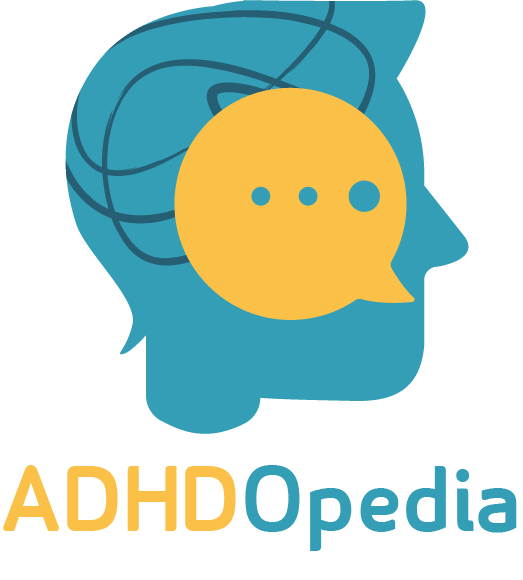

<br />
<div align="center">
  <a href="https://github.com/ahmedabdel-hady/adhdopedia">
    
  </a>

  <h3 align="center">ADHDopedia</h3>

  <p align="center">
    Google Solution Challenge 2022!
    <br />
    <a href="https://adhdopedia.geeksy.tech/"><strong>View Demo »</strong></a>
    <br />
    <br />
</div>

## About The Project

[![Product Name Screen Shot][product-screenshot]](https://adhdopedia.geeksy.tech/)

ADHDOpedia is online learning platform for ADHD Students where are able to manage their courses through plenty of useful tools. The website includes a pomodoro timer as it is proved as an effective technique for staying focused. It provides a to do list as well as classes schedule so that the student is reminded by his assignments. To ensure that he/she is paying attention while the timer is on, their eye movements are monitored via the webcam. Accordingly, they get notified when being distracted for a while. On the website, students can receive their grades, contact teachers, get access to course materials along with other beneficial books. They get notified whenever a teacher posts an announcement. In order to boost their morale, a chatting feature is added to allow individuals diagnosed with this disorder to form a supporting community. 


### Built With

Important one:

* [PHP](https://www.tensorflow.org/api_docs/python/tf/keras/Model)
* [codeigniter](https://codeigniter.com/)
* [opencv] (https://opencv.org/)
* [tensorflow.keras.models](https://vuejs.org/)
* [JS](https://www.javascript.com/)
* [Json] (https://www.json.org/)
* [CSS](https://www.w3schools.com/css/)
* [HTML5](https://www.w3schools.com/html/)
* [Bootstrap](https://getbootstrap.com)
* [JQuery](https://jquery.com)


<!-- GETTING STARTED -->
## Demo Test

Here is an Access data to test the software.
* Info
  ```sh
  Username:""
  Pass:""
  ```
<p align="right">(<a href="#top">back to top</a>)</p>
